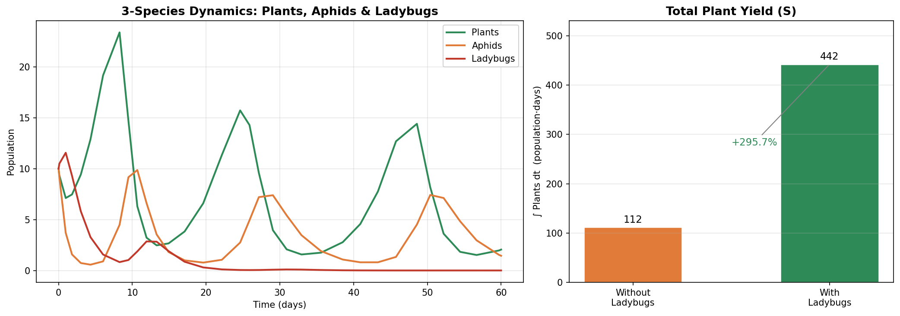
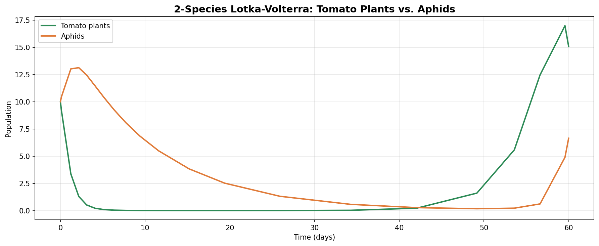
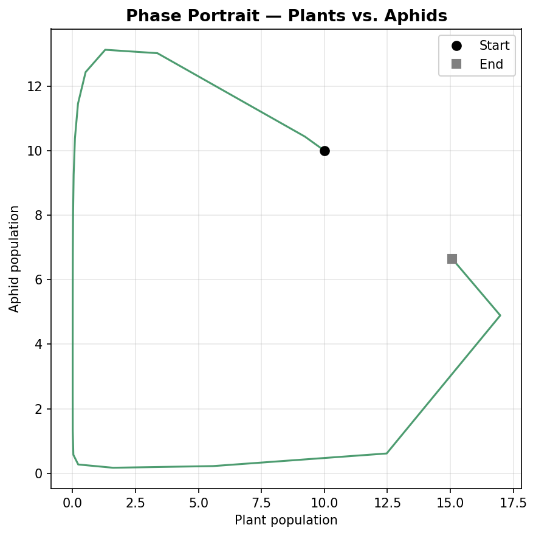
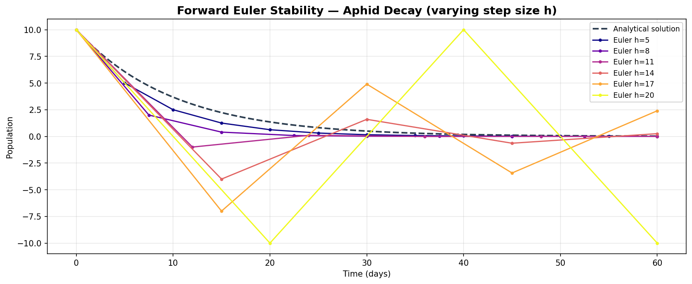
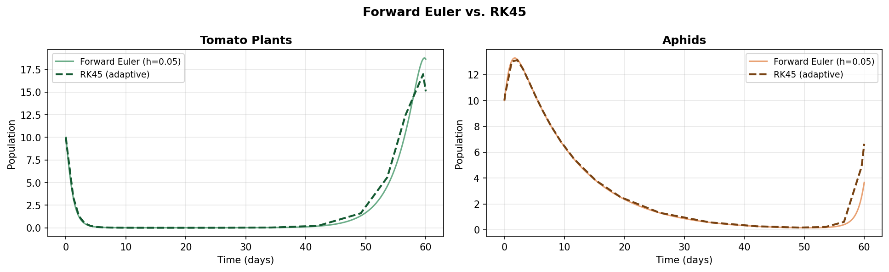

# Population Dynamics — Lotka-Volterra Simulations

Numerical simulation of predator-prey population dynamics using the **Lotka-Volterra equations**, applied to a real-world scenario: modelling the interaction between tomato plants, aphids (pests), and ladybugs (biological control agents).

The project builds from first principles — implementing a Forward Euler solver from scratch and analysing its stability — up to a full 3-species ecological model that quantifies the benefit of introducing ladybugs as a natural pesticide.

**Course:** Numerical Analysis I — Stockholm University (MM5016)

---

## Key Result

Introducing ladybugs as a biological control agent increased total plant yield by **+295.7%** over a 60-day growing season.



---

## Project Structure

```
population-dynamics/
├── src/
│   ├── models.py       # Lotka-Volterra ODE definitions (2- and 3-species)
│   ├── solvers.py      # Forward Euler (from scratch) + RK45 wrapper
│   ├── visualize.py    # Reusable plotting functions
│   └── main.py         # Run all simulations → saves plots to results/plots/
├── notebooks/
│   └── main.ipynb      # Step-by-step walkthrough of the full analysis
├── results/
│   └── plots/          # Generated figures (see below)
├── requirements.txt
└── README.md
```

---

## Models

### 2-Species: Plants vs. Aphids

$$\frac{dx}{dt} = \alpha x - \beta x y \qquad \frac{dy}{dt} = \delta x y - \gamma y$$

where $x$ = plant population, $y$ = aphid population.



The oscillatory coupling between plant growth and aphid predation produces the characteristic Lotka-Volterra cycles. The phase portrait below shows the closed orbit in state space:



### 3-Species: Plants + Aphids + Ladybugs

$$\frac{dw}{dt} = \eta y w - \zeta w$$

Ladybugs ($w$) are added as a third species that feed on aphids, suppressing their population and allowing plants to recover. See the key result plot above.

---

## Numerical Methods

### Forward Euler (implemented from scratch)

$$y_{n+1} = y_n + h \cdot f(t_n,\ y_n)$$

The solver's stability boundary for the test equation $y' = -\gamma y$ is $h < 2/\gamma$. The plot below shows what happens as $h$ approaches and crosses this limit:



### Forward Euler vs. RK45

The same system solved with a hand-written Forward Euler ($h = 0.05$) vs. scipy's adaptive RK45:



RK45 adapts its step size automatically, using far fewer evaluations while maintaining higher accuracy.

---

## Getting Started

```bash
pip install -r requirements.txt
python src/main.py
```

Plots are saved to `results/plots/`. To explore interactively, open `notebooks/main.ipynb` in Jupyter.

---

## What's Next

- [ ] Interactive parameter explorer (Streamlit or Panel app)
- [ ] Spatial extension: reaction-diffusion PDE on a 2D grid
- [ ] Stochastic version with demographic noise
- [ ] Fit parameters to real aphid/plant field data

---

## References

- Lotka, A. J. (1925). *Elements of Physical Biology.* Williams & Wilkins.
- Volterra, V. (1926). Variazioni e fluttuazioni del numero d'individui in specie animali conviventi.
- Burden, R. & Faires, J. D. (2010). *Numerical Analysis*, 9th ed. Brooks/Cole.
